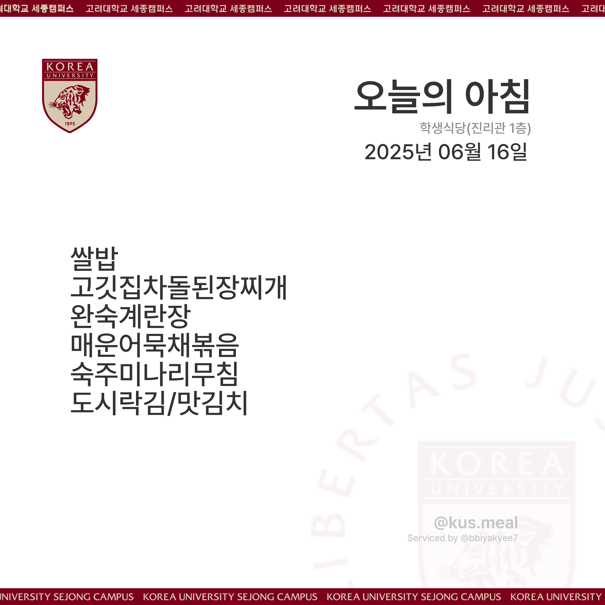

# 📅 고려대학교 세종캠퍼스 학식 자동 업로드 봇

고려대학교 세종캠퍼스 학생식당과 교직원식당의 메뉴를 매일 자동으로 크롤링하여 인스타그램에 이미지로 업로드해주는 자동화 프로그램입니다.

---

## 📌 주요 기능

- 매일 자정 이후(00:01) 식단 정보 자동 크롤링
- 학생식당 & 교직원식당의 식단을 분리하여 이미지 생성
- 날짜 및 메뉴가 포함된 인스타그램 업로드용 이미지 생성
- 인스타그램 계정에 자동 업로드

---

## 🛠 사용 기술

- `Selenium` – JS 렌더링 페이지 크롤링
- `BeautifulSoup` – HTML 파싱 및 데이터 추출
- `Pillow` – 이미지 처리 및 텍스트 삽입
- `instagrapi` – 인스타그램 업로드 API
- `schedule` – 일정 예약 실행
- `.env` – 환경 변수 파일로 민감 정보 관리

---

## 📂 폴더 구조

```
📁 project_root/
├── assets/                # 식단 종류별 배경 이미지 폴더
│   ├── morning.png
│   ├── lunch(b).png
│   ├── lunch(j).png
│   ├── lunch(k).png
│   └── dinner.png
├── build/                 # 결과 이미지 저장 폴더 (자동 생성)
├── Pretendard-Medium.ttf  # 사용되는 폰트 파일
├── .env                   # 인스타그램 계정 정보 저장 파일 (비공개)
├── backup.py              # 백업코드파일 (즉시 업로드)
├── main.py                # 전체 코드 실행 파일
└── README.md              # 프로젝트 설명 파일
```

---

## ⚙️ .env 설정

인스타그램 계정 정보는 `.env` 파일을 통해 불러옵니다. 프로젝트 루트에 `.env` 파일을 생성하고 아래 내용을 입력하세요:

```
env
IG_USERNAME=your_instagram_username
IG_PASSWORD=your_instagram_password
```


⸻

## ⏱ 실행 주기
•	매주 월요일부터 금요일까지, 매일 00:01에 자동 실행
•	schedule 라이브러리를 통해 스케줄 관리

⸻

## 🖼 샘플 이미지

생성된 이미지는 날짜와 메뉴 정보가 포함된 다음과 같은 포맷입니다.

📌 조식


※ 위 이미지는 예시이며, 실제 메뉴는 사이트에서 자동으로 크롤링됩니다.

⸻

## 🧪 실행 방법

1. 필요한 패키지 설치

```
pip install -r requirements.txt
```

2. ChromeDriver 설치
	•	Chrome 버전에 맞는 ChromeDriver를 설치하고 PATH에 등록하세요.

3. 실행

```
python main.py
```

백그라운드 실행이나 서버에서의 자동 실행은 cron 또는 systemd를 사용해 관리할 수 있습니다.

⸻

## 🙋‍♂️ 기여

PR 및 이슈 환영합니다!
고려대학교 세종캠퍼스의 편의를 위해 만들어진 오픈소스 프로젝트입니다.

⸻

## 📄 라이선스

MIT License
